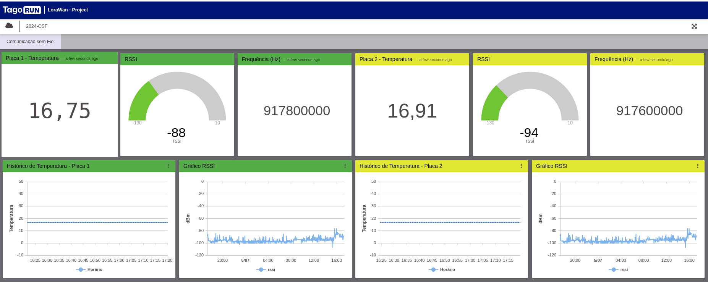

# Projeto com Kit LoRa para a aula de Comunicações Sem Fio
Repositório com a documentação do projeto com o módulo LoRa para a aula de Comunicações sem Fio

## Introdução

Neste relatório, exploramos a tecnologia LoRaWAN, um protocolo de comunicação sem fio amplamente utilizado na Internet das Coisas (IoT). O foco é entender seus conceitos teóricos, realizar cálculos de enlace, simulações práticas e programação de dispositivos com a tecnologia LoRaWAN. Além disso, discutiremos a integração de sensores DHT11 e LDR, e a comunicação desses sensores com um servidor através do módulo LoRaWAN Bee.

## Parte Teórica

### Conhecimento da Tecnologia LoRaWAN

LoRaWAN (Long Range Wide Area Network) é um protocolo de comunicação baseado na modulação LoRa da Semtech, projetado para redes de longa distância com baixa taxa de dados. É ideal para aplicações que requerem baixo consumo de energia e comunicação intermitente.

- **Camadas de uma Aplicação LoRaWAN**:
  - **Dispositivo Final (End Device)**: Se comunica com o gateway.
  - **Gateway**: Transmite os dados para o servidor de rede.
  - **Servidor de Rede**: Encaminha os dados para o servidor de aplicação.
  - **Servidor de Aplicação**: Processa e apresenta os dados ao usuário.

- **Classes de Dispositivos**: LoRaWAN define três classes de dispositivos:
  - **Classe A**: Prioriza o menor consumo de energia, com recepção de dados em janelas específicas após o envio de uma mensagem.
  - **Classe B**: Sincroniza periodicamente com o gateway, permitindo janelas de recepção mais previsíveis.
  - **Classe C**: Mantém a recepção contínua, resultando em maior consumo de energia, mas permitindo a recepção imediata de mensagens.

### Cálculo de Enlace na Teoria e Prática

O cálculo de enlace envolve a análise da propagação do sinal e as condições de comunicação entre o dispositivo e o gateway. Fatores como a distância, obstáculos físicos e a potência do sinal influenciam a qualidade da comunicação.

- **Teoria do Cálculo de Enlace**: Utilizamos a equação de Friis e o modelo de perda de caminho para estimar a potência do sinal recebido em função da distância e da frequência de operação.
- **Prática do Cálculo de Enlace**: Realizamos testes em campo e simulações com software, como o Radio Mobile, para validar as previsões teóricas e ajustar os parâmetros do enlace conforme necessário.

### Simulação em Software e Radio Mobile

Para prever e otimizar o desempenho de uma rede LoRaWAN, utilizamos ferramentas de simulação que modelam a propagação do sinal e a cobertura de rede. O Radio Mobile é um software especializado para simulação de propagação de ondas de rádio em redes de comunicação.

- **Configuração do Radio Mobile**: Configuramos o software com parâmetros específicos do enlace, como frequência, potência de transmissão e características da antena.
- **Simulação de Cobertura**: Realizamos simulações para mapear a cobertura de rede, identificando áreas com boa recepção e potenciais zonas de sombra.

## Programação na Placa

### Descrição

No experimento, utilizamos o sensor DHT11 para medir temperatura e umidade, e um sensor LDR para detectar luminosidade. Integramos esses sensores com o IoT DevKit e programamos o dispositivo para ler os dados e enviá-los ao servidor usando LoRaWAN.

- **Sensor DHT11**: Capaz de medir temperatura e umidade. Foi integrado utilizando uma biblioteca específica que simplifica a leitura dos dados.
- **Sensor LDR**: Mede a intensidade da luz ambiente. Programamos o dispositivo para ler o valor do sensor sempre que um botão é pressionado.
- **Bibliotecas Utilizadas**: Utilizamos a biblioteca `RoboCore_SMW_SX1276M0` para comunicação com o módulo LoRaWAN Bee e a biblioteca específica do DHT11 para leitura de dados.

### Primeira Comunicação com o Módulo LoRaWAN Bee

Para comunicar-se pela primeira vez com o módulo LoRaWAN Bee, instalamos a biblioteca necessária e configuramos o dispositivo para se conectar à rede LoRaWAN. Este processo envolve a configuração de parâmetros como o Application EUI, Application Key e Device EUI.

## Problemas Encontrados

Durante o desenvolvimento e implementação, encontramos diversos desafios:

- **Configuração da Rede LoRaWAN**: A complexidade na configuração inicial dos parâmetros de conexão, especialmente ao usar o método OTAA, exigiu atenção especial.
- **Interferência de Sinal**: Testes de campo revelaram interferências de sinal em áreas urbanas densas, afetando a qualidade do enlace.
- **Reconfiguração da placa**: Configuração de região para Austrália, onde o padrão é Coréia do Sul, canais de operação e EUI.

## Conclusão

Este relatório cobriu o conhecimento teórico e prático da tecnologia LoRaWAN, o cálculo de enlace e a simulação de cobertura de rede. Também exploramos a programação do IoT DevKit para integrar sensores de temperatura, umidade e luminosidade, e sua comunicação com um servidor usando LoRaWAN. Apesar dos desafios encontrados, o uso de LoRaWAN se mostrou promissor para aplicações de IoT que exigem comunicação de longa distância e baixo consumo de energia.

---

**Referências:**
- Documentação oficial LoRaWAN.
- Tutoriais sobre configuração e programação do IoT DevKit.
- Ferramentas de simulação como Radio Mobile.

# Tabela de Atividades

|  Responsável | Atividade |
|-------------------|------------|
|   Alana       | |
| Ana Paula   | |
|   Deivit      | |
|  João Pedro  |     |
|  Filipe      |    |
|   Yago        |   |

