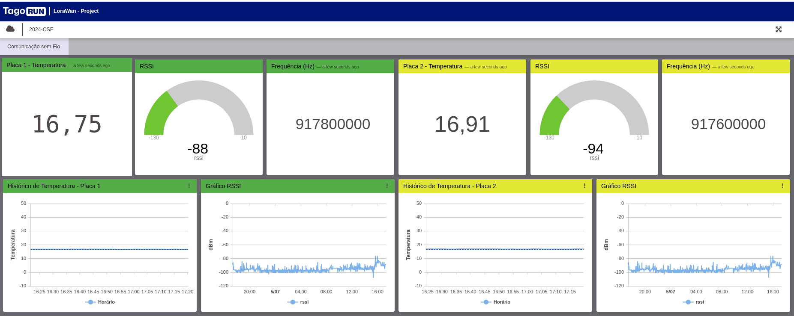
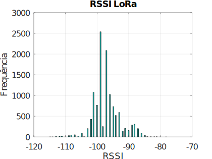

# Projeto com Kit LoRa para a aula de Comunicações Sem Fio

Repositório com a documentação do projeto com o módulo LoRa para a aula de Comunicações sem Fio do curso de Engenharia de Telecomunicações do Instituto Federal de Santa Catarina (IFSC), campus São José.

### Tabela de conteúdos

- [Projeto com Kit LoRa para a aula de Comunicações Sem Fio](#projeto-com-kit-lora-para-a-aula-de-comunicações-sem-fio)
    - [Tabela de conteúdos](#tabela-de-conteúdos)
  - [Introdução](#introdução)
  - [Parte Teórica](#parte-teórica)
    - [Conhecimento da Tecnologia LoRaWAN](#conhecimento-da-tecnologia-lorawan)
    - [Cálculo de Enlace na Teoria e Prática](#cálculo-de-enlace-na-teoria-e-prática)
    - [Simulação em Software e Radio Mobile](#simulação-em-software-e-radio-mobile)
  - [Programação na Placa](#programação-na-placa)
    - [Dispositivo utilizado](#dispositivo-utilizado)
    - [Descrição](#descrição)
      - [Bibliotecas Utilizadas](#bibliotecas-utilizadas)
    - [Comunicação com o Módulo LoRaWAN Bee](#comunicação-com-o-módulo-lorawan-bee)
      - [Tago.IO](#tagoio)
      - [Histograma de RSSI](#histograma-de-rssi)
  - [Análide dos dados Outdoor](#análide-dos-dados-outdoor)
    - [Locais das coletas de dados e distâncias para o gateway](#locais-das-coletas-de-dados-e-distâncias-para-o-gateway)
    - [Compilação](#compilação)
  - [Problemas Encontrados](#problemas-encontrados)
  - [Conclusão](#conclusão)
- [Quadro de Atividades](#quadro-de-atividades)

## Introdução

Neste relatório é descrito o experimento realizado com LoRaWAN, um protocolo de comunicação sem fio amplamente utilizado na Internet das Coisas (IoT). O foco é entender seus conceitos teóricos, realizar cálculos de enlace, simulações práticas e programação de dispositivos com tal tecnologia.

## Parte Teórica

### Conhecimento da Tecnologia LoRaWAN

LoRaWAN (Long Range Wide Area Network) é um protocolo de comunicação baseado na modulação LoRa da Semtech, projetado para redes de longa distância com baixa taxa de dados. É ideal para aplicações que requerem baixo consumo de energia e comunicação intermitente.

- **Camadas de uma Aplicação LoRaWAN**:
  - **Dispositivo Final (End Device)**: Se comunica com o gateway.
  - **Gateway**: Transmite os dados para o servidor de rede.
  - **Servidor de Rede**: Encaminha os dados para o servidor de aplicação.
  - **Servidor de Aplicação**: Processa e apresenta os dados ao usuário.

- **Classes de Dispositivos**:
  - **Classe A**: Deve ser suportada por todos os dispositivos LoRaWAN. O envio de mensagem pode ser realizado a qualquer momento, sendo que, uma vez concluído, o dispositivo abre duas janelas para a receber mensagens da rede. Há um perído entre o fim da transmissão e o início das janelas de recepção, conhecidos como *RX1 Delay* e *RX2 Delay*, respectivamente. O servidor pode responder durante a primeira janela (RX1) ou durante a segunda janela (RX2), mas nunca utilizar as duas. Caso a resposta seja recebida ainda durante a primeira janela, a segunda janela não é aberta. Se não houver resposta, o próximo recebimento é reagendado quando o envio seguinte for realizado. A latência de recepção é alta pois é preciso sempre enviar algo (*uplink*) para ter resposta (*downlink*).

    Os dispositivos Classe A possuem baixíssimo consumo de energia, podendo operar através de baterias. Na maior parte do tempo, estão em estado dormente.

  - **Classe B**: Extendem a capacidade dos dispositivos Classe A, abrindo janelas de recepção periodicamente, chamadas de *ping slots*. Com a rede transmitindo um sinal de sincronização de tempo através dos *gateways*, o *clock* interno do dispositivo é sincronizado com a rede, permitindo que o servidor saiba quando enviar mensagens (*downlink*) para um dispositivo específico ou um grupo de dispositivos. O intervalo entre os sinais de sincronização é chamado de "Beacon Period".
  Após o envio de uma mensagem (*uplink*), as duas pequenas janelas de recepção, RX1 e RX2, são abertas de forma semelhante ao que ocorre nos dispositivos Classe A.

    A latência dos dispositivos Classe B é menor do que a dos dispositivos Classe A, porém muito maior do que a dos dispositivos Classe C. Podem ser alimentados por bateria, porém, a duração da mesma é menor já que os dispositivos gastam mais tempo estando ativos recebendo a sinalização  (*beacons*) e abrindo "ping slots".

  - **Classe C**: Mantém a recepção contínua a menos que uma mensagem seja enviada (*uplink*). Por conta disso, os dispositivos Classe C podem receber mensagens a qualquer momento, possuindo, assim, uma latência muito baixa de recepção (*downlink*). Essas mensagens podem ser utilizadas para controlar dispositivos, como reduzir a intensidade luminosa de lâmpadas ou desligar motores.

    Assim como nos dispositivos Classe A, duas janelas de recepção são abertas, RX1 e RX2. Entretanto, a última mantém-se aberta até que o próximo envio de mensagem seja realizado. Após isso acontecer, uma pequena janela de recepção RX2 é aberta, seguida de uma pequena janela de recpção RX1 e, então, uma janela de recepção RX2 contínua é aberta. O envio de mensagens só realizado quando não há mensagens sendo recebidas.

    Se comparados com os dispositivos Classe A e Classe B, os Classe C possuem a menor latência de todos. Entretanto, o consumo de energia é o maior de todos, já que o dispositivo está sempre ativo. Por conta disso, o uso de bateria é realizado por um curto período de tempo, sendo que geralmente são alimentados por fontes de energia externas.

### Cálculo de Enlace na Teoria e Prática

O cálculo de enlace envolve a análise da propagação do sinal e as condições de comunicação entre o dispositivo e o gateway. Fatores como a distância, obstáculos físicos e a potência do sinal influenciam a qualidade da comunicação.

- **Teoria do Cálculo de Enlace**: Foi utilizada a equação de Friis e o modelo de perda de caminho para estimar a potência do sinal recebido em função da distância e da frequência de operação.
- **Prática do Cálculo de Enlace**: Foram realizados testes em campo e simulações com *software*, como o Radio Mobile, para validar as previsões teóricas e ajustar os parâmetros do enlace conforme necessário.

### Simulação em Software e Radio Mobile

Para prever e otimizar o desempenho de uma rede LoRaWAN, foram utilizadas ferramentas de simulação que modelam a propagação do sinal e a cobertura de rede. O Radio Mobile é um software especializado para simulação de propagação de ondas de rádio em redes de comunicação.

- **Configuração do Radio Mobile**: Foi configurado o *software* com parâmetros específicos do enlace, como frequência, potência de transmissão e características da antena.
- **Simulação de Cobertura**: Foram realizadas simulações para mapear a cobertura de rede, identificando áreas com boa recepção e potenciais zonas de sombra.

## Programação na Placa

### Dispositivo utilizado

O kit de desenvolvimento utilizado foi o [IoT DevKit - LoRaWAN](https://www.robocore.net/lorawan/iot-devkit-lorawan) da Robocore.

O _hardware_ em questão possui um _NodeMCU_ com o módulo da ESP32 dotado com as seguintes características:

- Processador: Xtensa® Dual-Core 32-bit LX6
- Memória Flash programável: 4 MB
- Clock máximo: 240 MHz
- Memória RAM: 520 KBytes
- Memória ROM: 448 KBytes
- 25 pinos digitais com PWM de resolução de até 16 bits
- Wireless 802.11 b/g/n - 2.4GHz
- Bluetooth Low Energy padrão 4.2
- Tensão de alimentação externa: 4,5 V a 9 V

A placa de desenvolvimento a qual o _NodeMCU_ foi utilizado conta com os seguintes sensores:

- DHT11 para temperatura e umidade, conectado no pino 12;
- Sensor de luminosidade conectado no pino 15;
- Botão conectado no pino 4;
- Acelerômetro de 3 eixos, conectados nos pinos de interrupção 34 e 35.

### Descrição

No experimento, foi utilizado o sensor DHT11 para medir temperatura, sendo a mesma enviada para a TTN.

#### Bibliotecas Utilizadas

Foi utilizada a biblioteca [`RoboCore_SMW_SX1276M0`](https://github.com/RoboCore/RoboCore_SMW-SX1276M0) para comunicação com o módulo LoRaWAN Bee e a biblioteca específica do DHT11 para leitura de dados.

Além disso, foi utilizada uma [biblioteca própria](https://github.com/jpmsb/dicas/blob/master/PlatformIO/LoRaWan-TTN-Temperatura/src/TemperatureHumidity.h) para operar tal sensor de forma mais abstraída.

### Comunicação com o Módulo LoRaWAN Bee

Para realizar a comunicação do IoT DevKit com o módulo LoRaWAN Bee, foi [criado um projeto](https://github.com/jpmsb/dicas/tree/master/PlatformIO/LoRaWan-TTN-Temperatura) utilizando o kit de ferramentas do [PlatformIO](https://github.com/jpmsb/preparando-computador-para-engenharia-de-tele/blob/main/guias-de-aplicacoes/PlatformIO.md).

No arquivo [`gravar`](https://raw.githubusercontent.com/jpmsb/dicas/master/PlatformIO/LoRaWan-TTN-Temperatura/gravar), foram preenchidas as variáveis "appeui" e "appkey", obtidas na TTN.

#### Tago.IO

O Tago.IO é uma plataforma de IoT que permite a criação de dashboards personalizados para visualização de dados em tempo real. Foi utilizado para exibir os dados de temperatura enviados pelo IoT DevKit.

<figure style="text-align: center; border: 2px solid black; border-radius: 0px; padding: 0; box-sizing: border-box;">
    

        <figcaption>
            <strong>Figura 2:</strong> Histograma de RSSI.
        </figcaption>
    

    
    

        <figcaption>
            Fonte: Autoria própria.
        </figcaption>
    

</figure>

Na imagem acima, é mostrada uma tela do serviço contendo dados de temperatura, nível de sinal RSSI, a frequência instantânea de operação, bem como os históricos de temperatura e RSSI, de dois dispositivos.

É possível acessar o painel acima [clicando aqui](https://6633ed143971a700094a0b31.tago.run/dashboards/info/66353cb5819ced0008b3cea4?anonymousToken=00000000-6633-ed14-3971-a700094a0b31).

#### Histograma de RSSI

Para acompanhar o padrão da potência recebida, o dispositivo LoRa foi mantido em um ambiente fixo durante alguns dias, permitindo a coleta de dados para verificar a variação do RSSI.

<figure style="text-align: center; border: 2px solid black; border-radius: 10px; padding: 0; box-sizing: border-box; overflow: hidden;">
    

        <figcaption>
            <strong>Figura 2:</strong> Histograma de RSSI.
        </figcaption>
    

    
    

        <figcaption>
            Fonte: Autoria própria.
        </figcaption>
    

</figure>

Para contexto, o dispositivo foi mantido em um ambiente fechado contendo janelas cujo vidro era coberto de película reflexiva. Além disso, computadores com carcaças metálicas estavam presentes no ambiente. Esse cenário faz com que ocorram refrações e reflexões no sinal.

Abaixo, está uma tabela contendo a os dados mostrados no histograma, medidos entre os dias 15 a 24 de maio de 2024:

| RSSI | Ocorrências |
|------|-------------|
| -115 |    2        |
| -114 |    2        |
| -113 |    8        |
| -112 |   11        |
| -111 |   18        |
| -110 |    1        |
| -109 |   32        |
| -108 |   44        |
| -107 |   51        |
| -106 |   20        |
| -105 |   94        |
| -104 |    5        |
| -103 |  202        |
| -102 |  424        |
| -101 | 1076        |
| -100 |  767        |
|  -99 | 2539        |
|  -98 |  250        |
|  -97 | 2087        |
|  -96 | 1020        |
|  -95 |  731        |
|  -94 |  518        |
|  -93 |  592        |
|  -92 |  139        |
|  -91 |  203        |
|  -90 |  156        |
|  -89 |  286        |
|  -88 |  306        |
|  -87 |  200        |
|  -86 |   88        |
|  -85 |   33        |
|  -84 |    7        |
|  -83 |    5        |
|  -82 |    4        |
|  -81 |    5        |
|  -80 |    1        |
|  -78 |    1        |

Analisando a tabela, é possível observar que a maior parte dos dados está concentrada entre -102 e -93 dBm. A maior quatidade de ocorrências foi em -99 dBm, com 2539 registros. Somando tudo, a quantidade de registros foi de 11928.

## Análide dos dados Outdoor

Para análise dos dados, como em algumas coletas foram usados dois dispositivos transmissores, o professor sugeriu que se fizesse a compilação dos dados recebidos na forma de uma comunicação com múltiplas antenas transmissoras e uma receptora (Multiple-Input Single-Output), conhecida como MISO.

Assim, a compilação foi gerada admitindo-se o melhor valor RSSI entre as duas placas dentro dos instantes de tempo aproximados nas faixas de 10 segundos, tempo configurado para os dispositivos transmitirem.

A tabela abaixo apresenta os números totais de amostras admitidas de cada dispositivo para obter a comunicação MISO.

| Local                    | Amostras | Amostras - Placa 1 | Amostras - Placa 2 |
|--------------------------|----------|---------|---------|
| IFSC                     | 21       |     -    | 21      |
| Mirante                  | 19       |      -   | 19      |
| Rua prox. Bar do Xande 1 | 14       |       -  | 14      |
| Rua prox. Bar do Xande 2 | 21       | 9       | 12      |
| Praia                    | 20       | 9       | 11      |
| Beira Mar (Inicio)       | 24       | 7       | 17      |
| Beira Mar (Meio)         | 30       | 5       | 25      |
| Beira Mar (Final)        | 22       | 13      | 9       |
| **Total**                | **171**  | **43**  | **128** |

### Locais das coletas de dados e distâncias para o gateway

| Local                   | Distancia (m) | Latitude   | Longitude   |
|-------------------------|---------------|------------|-------------|
| IFSC                     | 140           | -27.608121 | -48.632408  |
| Mirante                  | 493           | -27.611804 | -48.636358  |
| Rua prox. Bar do Xande 1 | 738           | -27.614435 | -48.632043  |
| Rua prox. Bar do Xande 2 | 738           | -27.614435 | -48.632043  |
| Praia                   | 1247          | -27.617875 | -48.627848  |
| Beira Mar (Inicio)      | 891           | -27.611009 | -48.625449  |
| Beira Mar (Meio)        | 2000          | -27.603921 | -48.614052  |
| Beira Mar (Final)       | 3132          | -27.602656 | -48.602604  |

### Compilação

| Local                    | Média RSSI  | Máximo | Mínimo | Desvio Padrão |
|--------------------------|--------|--------|--------|---------------|
| IFSC                     | -89,24 | -82    | -102   | 5,97          |
| Mirante                  | -95,42 | -89    | -105   | 3,19          |
| Rua prox. Bar do Xande 1 | -109,43| -101   | -115   | 4,22          |
| Rua prox. Bar do Xande 2 | -102,57| -89    | -114   | 5,23          |
| Praia                    | -109,50| -93    | -115   | 4,98          |
| Beira Mar (Inicio)       | -93,00 | -86    | -102   | 4,02          |
| Beira Mar (Meio)         | -90,77 | -75    | -102   | 5,45          |
| Beira Mar (Final)        | -91,45 | -86    | -97    | 2,86          |

O ponto mais próximo ao gateway, na esquina do IFSC, obteve a melhor média de recepção com -89,24 dBm, e a pior média ficou com o ponto "Praia", transmitido da beira da praia, no final da Rua Antônio Ferreira, próximo ao Centro Histórico de São José, com -109,5 dBm.

A média RSSI dos dados transmitidos da praia foi obtida a uma distância de 1247 metros, enquanto o ponto mais distante, "Beira Mar (Final)", a 3132 metros, gerou uma média de -91,45 dBm, demonstrando que fatores como reflexão próxima ao mar, vegetação, relevos e construções podem influenciar muito na qualidade de uma transmissão sem fio.

| Local                    | RSSI medido | Perda de Percurso | Distancia (m) |
|--------------------------|-------------|-------------------|---------------|
| IFSC                     | -89,24      | -89,2             | 140           |
| Mirante                  | -95,42      | -94,2             | 493           |
| Rua prox. Bar do Xande 1 | -109,43     | -95,8             | 738           |
| Rua prox. Bar do Xande 2 | -102,57     | -95,8             | 738           |
| Praia                    | -109,50     | -97,8             | 1247          |
| Beira Mar (Inicio)       | -93,00      | -96,5             | 891           |
| Beira Mar (Meio)         | -90,77      | -99,7             | 2000          |
| Beira Mar (Final)        | -91,45      | -101              | 3132          |

Os calculos para Perda de Percurso foram realizadas com base no Modelo de propagação Log-Distância.

$$ {PL}(dB) = {PL}(d_0) + 10n\log_{}\left(\frac{d}{d_0}\right)
$$

- [`Arquivo usado para o calculo da Perda de Percurso`](dados-rssi/perda_de_percurso.m).
- [`Tabela com os dados usados para gerar a compilação MISO `](dados-rssi/dados_outdoor_miso.md)
## Problemas Encontrados

Durante o desenvolvimento e implementação, foram observados os pontos:

- **Configuração do dispositivo para se comunicar com a Rede LoRaWAN**: Houve complexidade inicial, principalmente por conta das desconexões frequêntes. Para sanar essa questão, foi criada uma rotina na programação que reiniciava a placa caso a conexão tivesse sido perdida ou caso o dispostivo não tenha conseguido se conectar à rede durante uma certa quantidade de tempo. Esse tempo limite é facilmente definido no arquivo [`gravar`](https://raw.githubusercontent.com/jpmsb/dicas/master/PlatformIO/LoRaWan-TTN-Temperatura/gravar);

- **Reconfiguração da placa**: Após certos ciclos de desligamentos, foi necessário reajustar a faixa de frequência do módulo para o padrão australiano, além de ativar os oito canais do padrão utilizados pela TTN. Além disso, foi necessário reajustar o DEVEUI, que assumiu o valor padrão 0000000000000000. Para tal, foram utilizados os seguintes comandos AT:

  - Reconfigurar a região de operação para a Austrália: `AT+REGION 1`;
  - Ajuste dos canais: `AT+CH canal status=0` para canais de 0 a 7 e de 16 a 71. `AT+CH canal status=1` para os demais;
  - Ajuste do DEVEUI: `AT+DEVEUI valor_deveui`.

  No arquivo [`gravar`](https://raw.githubusercontent.com/jpmsb/dicas/master/PlatformIO/LoRaWan-TTN-Temperatura/gravar), há uma variável gatilho para realizar essa reconfiguração. Caso a variável `reconfigurar` seja definida para "true", as configurações citadas acima serão aplicadas sempre que a ESP32 for iniciada.

## Conclusão

Este relatório cobriu o conhecimento teórico e prático da tecnologia LoRaWAN, o cálculo de enlace e a simulação de cobertura de rede. A programação do IoT DevKit foi explorada para integrar o sensor de temperatura, e sua comunicação com um servidor usando LoRaWAN.

---

**Referências:**
- Documentação oficial LoRaWAN.
- Tutoriais sobre configuração e programação do IoT DevKit.
- Ferramentas de simulação como Radio Mobile.

# Quadro de Atividades

|  Responsável | Atividade           |
|--------------|---------------------|
| Alana        |                     |
| Ana Paula    | Tago.IO e relatório |
| Deivid       |                     |
| João Pedro   | COD, DOC            |
| Filipi       |     RM              |
| Yago         |     RM              |

Legenda:

 - **COD**: criação ou manutenção do código-fonte utilizado na ESP32, para a configuração, funcionamento e comunicação do módulo LoRaWAN com a TTN (The Things Network).
 - **DOC**: criação ou manutenção da documentação do projeto, incluindo este arquivo README.md.
 - **RM**: criação ou manutenção dos links de comunicação no software Radio Mobile.
